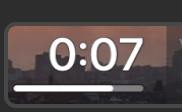
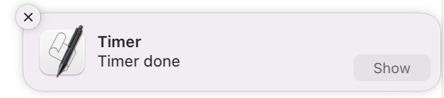

# StreamDeck+ timer

This is a simple timer for the StreamDeck+ that allows you to set a timer for a specific amount of time in 30 second increments by using a dial.
When the timer is up, the StreamDeck will display a message and play a sound.

---

